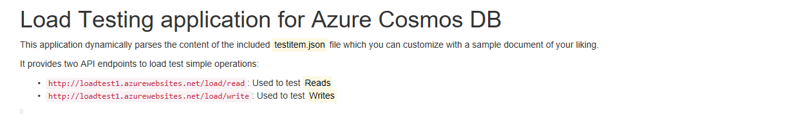
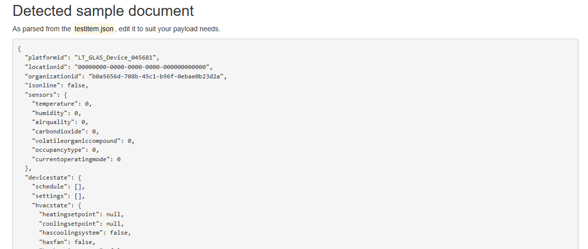

# ASP.NET Core load test app for Azure Cosmos DB

This repo contains an ASP.NET Core web application that can be used to load test an Azure Cosmos DB account and verify if the amount of provisioned [RU/s](https://docs.microsoft.com/azure/cosmos-db/request-units) can manage an hypothetical concurrent user load.

It exposes two API endpoints, one for Reads and one for Writes, where a Load Test framework or service can be used. Once the app runs, it will provide a visual aid for the endpoints based on the current host.

You can deploy it to a service like [Azure App Service](https://azure.microsoft.com/en-us/services/app-service/), which includes a [Load Test feature](https://docs.microsoft.com/en-us/vsts/load-test/app-service-web-app-performance-test).

The repo includes a [testitem.json](./src/testitem.json) file you can customize with an estimate JSON payload you will be storing in your database. This payload will be used to test both Reads and Writes to **generate the most accurate RU/s consumption**.

>This app can be used after estimating a value with the [Azure Cosmos DB Capacity Planner](https://www.documentdb.com/capacityplanner).

## Configuration

Before deploying this app, edit the [appsettings.json](./src/appsettings.json) file and set your Azure Cosmos DB account credentials and optionally, an Azure App Insights Instrumentation Key if you want more detailed analytics.

    "CosmosDb": {
        "Account": "your-account-name",
        "Key": "your-account-password",
        "DatabaseName": "your-database-name",
        "CollectionName": "your-collection-name"
    },
    "ApplicationInsights": {
        "InstrumentationKey": "appinsights-key"
    }

## Setting up the tests

Refer to [this article](https://medium.com/@Ealsur/load-testing-azure-cosmos-db-with-asp-net-core-6b4514980d1b) for a full coverage on how to create tests in Azure App Service.